<div align="center">
  
</div>

<br/>

<div align="center">

[](https://github.com/ronaldweasly)
[](https://linkedin.com/in/himanshuxshukla)
[](mailto:the.himanshushukla0@gmail.com)
[](#)

</div>

---

## 🛠️ Tech Stack

<div align="center">

**☁ Cloud & DevOps**


**⚡ Backend & Databases**


**🧠 AI & Automation**


**🔧 CI/CD & Monitoring**


</div>

---

## 🔥 Featured Projects

### 🚀 [CloudHarvest — Autonomous Lead Intelligence Platform](https://github.com/ronaldweasly)

> **$2 per 1,000 qualified leads · 7 production campaigns · €12,000 client revenue**

```
AWS Architecture:  VPC → ALB → SQS → ECS Workers → RDS PostgreSQL → Google Sheets
AI Layer:          Lambda → Ollama (LLM scoring) → ICP matching → n8n webhook
Scale:             0 → 20 ECS workers in under 2 min · 500+ domains/run
```

- Terraform-provisioned VPC with ALB, private worker subnets, SQS job queues
- SQS queue depth drives ECS autoscaling — fully self-monitoring via CloudWatch + SNS
- Lambda invokes Ollama on dedicated EC2 to score each lead against ICP criteria
- 50GB+ S3 data lake with Glacier lifecycle archiving · cut cold-start time 60%


---

### 🤖 Autonomous AI Agency — Multi-Agent Workflow System

> **2 hours manual deploy → 11 minutes automated · 3× weekly ship velocity**

```
Pipeline:  GitHub Push → CodeBuild (test + SonarQube gate) → ECR → CloudFormation → ECS rolling deploy
Envs:      dev / staging / prod · fully AWS-native · zero manual steps
```

- Multi-agent system: lead discovery → code generation → QA → deployment
- LLM orchestration with isolated sandbox execution
- Serverless CI/CD with multi-environment promotion across dev/staging/prod


---

### 🧠 Railway Monitoring System — ML Fault Detection

> **50+ daily diagnostic reports automated · manual review: 3h → 20 min**

- Microservices-based ML platform for real-time fault detection & prediction
- Live monitoring dashboard with alerting (Grafana + Prometheus)
- Data flows mapped across large-scale on-premises monitoring stack


---

### 🎲 Board Game Web App — Full-Stack AWS Deployment

- Spring Boot + role-based authentication (Spring Security)
- Full CRUD · MVC architecture · AWS VPS deployment
- Reverse proxy routing (Nginx) + live monitoring (Grafana + Prometheus)


---

## 📊 GitHub Stats

<div align="center">


</div>

<div align="center">


</div>

---

## 🎯 Current Focus

```yaml
goals:
  - DevOps & cloud engineering (production-first)
  - System design & scalability
  - AWS Solutions Architect certification path
  - Building open-source cloud tooling
```

---

## 🏆 Certifications

| Certification | Issuer |
|---|---|
| 🔴 Red Hat Certified System Administrator (RHCSA) | Red Hat Inc. |
| 🍃 MongoDB Developer / Administrator | MongoDB University |
| 🚂 Infrastructure Internship | Indian Railways — BLW Varanasi, 2024 |

---

<div align="center">

**📫 Let's connect**

[](https://github.com/ronaldweasly)
[](https://linkedin.com/in/himanshuxshukla)

<br/>

*⭐ Consistency > Motivation*

</div>
